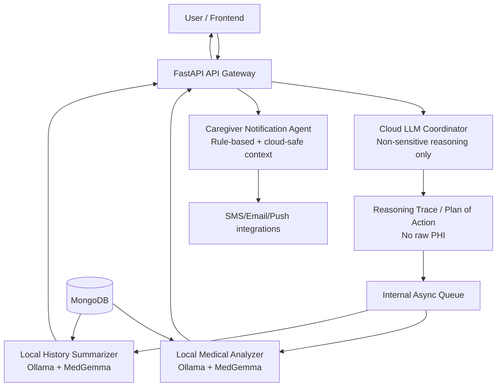
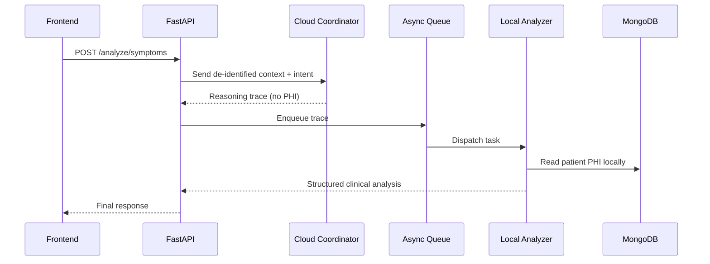
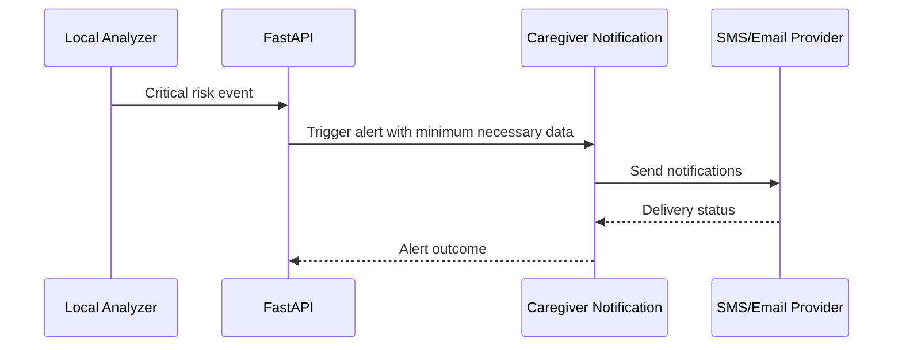
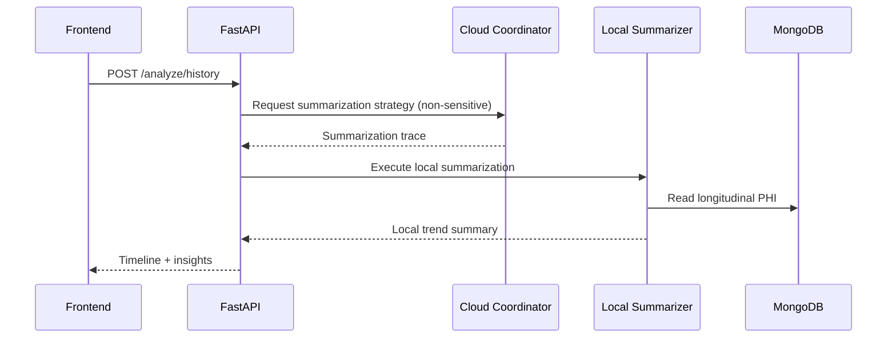

# AI Medical Multi-Agent Backend Implementation Plan

## 1) Purpose and Scope
This document consolidates the latest session decisions into one updated and comprehensive backend implementation plan for the AI Medical Multi-Agent project.

Primary goals:
- Keep PHI local at all times during sensitive processing.
- Use cloud reasoning only for non-sensitive planning/coordination.
- Deliver an asynchronous FastAPI backend that supports multi-agent workflows, patient records, alerts, and operational observability.

Out of scope for this plan:
- Frontend redesign.
- Full clinical validation/certification workflows.

## 2) Core Architecture Decision (Most Important)
Use a **two-stage hybrid pipeline**:
1. **Cloud stage (non-sensitive):** generate a Plan of Action / Reasoning Trace.
2. **Local stage (sensitive):** execute that plan against PHI using local Ollama + MedGemma.

Result:
- Intelligence outsourcing is possible without sending raw PHI to cloud APIs.
- PHI remains local by design.

## 3) System Context
- Backend framework: FastAPI (async)
- Local model runtime: Ollama (`OLLAMA_BASE_URL`, `OLLAMA_MODEL`)
- Cloud model runtime: Gemini (migrate to `google-genai` SDK)
- Database: MongoDB (prefer PyMongo async API path over Motor due deprecation)

## 4) Architecture Overview


## 5) PHI Boundary and Data Handling Rules
Hard requirements:
- Raw PHI must not be sent to cloud LLM APIs.
- Cloud prompts must contain only de-identified metadata and task intent.
- Local agents fetch PHI from local trusted stores and perform analysis locally.
- Every PHI read/write must be audit logged.
- Output sent to cloud services must pass sanitization policy.

Recommended data classes:
- **Class A (PHI/Sensitive):** symptoms, medical history, meds, identifiers.
- **Class B (Restricted metadata):** condition categories, risk tiers.
- **Class C (Non-sensitive):** workflow plan, execution status, generic analytics.

## 6) Request Lifecycle Flows
### 6.1 Symptom Analysis Flow


### 6.2 Emergency Alert Flow


### 6.3 Trend Summarization Flow


## 7) Functional Requirements
### 7.1 Platform and API
- FastAPI app with versioned routes (`/api/v1`).
- Async-first implementation across I/O boundaries.
- OpenAPI docs with endpoint auth annotations.

### 7.2 Agent Orchestration
- Coordinator creates Reasoning Traces that are executable and non-sensitive.
- Local agents execute traces deterministically against PHI.
- Internal queue decouples API latency from model execution latency.

### 7.3 Patient and Records Management
- CRUD for patient profiles.
- Storage for symptom submissions and analysis outputs.
- Longitudinal records to support trend summarization.

### 7.4 Alerting
- Risk scoring thresholds with configurable policies.
- Alert creation, dispatch, acknowledgement, and escalation.
- Delivery telemetry persistence.

### 7.5 Security and Compliance
- AuthN/AuthZ controls for API access.
- Encryption at rest and in transit.
- Access logs and audit trails for PHI operations.
- Data minimization and output sanitization checks.

## 8) Non-Functional Requirements
- P95 response for synchronous API request acceptance: <= 1.5s (task may continue async).
- Queue-backed task reliability with retries and dead-letter handling.
- Service health checks for DB, Ollama, and cloud API.
- Structured logs and metrics for model latency, queue lag, and alert success rates.
- Idempotency keys for critical write endpoints.

## 9) Proposed Backend Module Structure
```text
backend/
  app/
    main.py
    api/
      v1/
        routes_patients.py
        routes_analysis.py
        routes_alerts.py
        routes_health.py
    core/
      config.py
      security.py
      logging.py
      privacy.py
    db/
      client.py
      repositories/
    models/
      patient.py
      medical_record.py
      alert.py
      trace.py
    services/
      coordinator/
      local_agents/
      notifications/
      queue/
    workers/
      analysis_worker.py
      alert_worker.py
    tests/
      unit/
      integration/
```

## 10) Data Model Baseline
### Patient
- `id`, `name`, `dob`, `sex`, `conditions`, `medications`, `allergies`, timestamps

### MedicalRecord
- `id`, `patient_id`, `symptoms`, `entities`, `analysis_result`, `risk_level`, timestamps

### ReasoningTrace
- `id`, `task_type`, `instructions`, `allowed_data_classes`, `origin`, `expires_at`, timestamps

### Alert
- `id`, `patient_id`, `severity`, `trigger`, `channels`, `status`, `delivery_receipts`, timestamps

## 11) API Surface (Initial)
- `POST /api/v1/patients`
- `GET /api/v1/patients/{id}`
- `PUT /api/v1/patients/{id}`
- `POST /api/v1/analyze/symptoms`
- `POST /api/v1/analyze/history`
- `GET /api/v1/analysis/{id}`
- `POST /api/v1/alerts`
- `PUT /api/v1/alerts/{id}/acknowledge`
- `GET /api/v1/health`
- `GET /api/v1/health/dependencies`

## 12) Implementation Phases
### Phase 1: Foundation (Week 1-2)
- Scaffold FastAPI app, config, logging, health checks.
- Set up MongoDB client abstraction (future-safe async path).
- Add CI checks (lint, tests, type checks).

Exit criteria:
- Service starts, config validated, DB/Ollama/cloud health endpoints pass.

### Phase 2: Core Domain + API (Week 3-4)
- Implement patient and record repositories + endpoints.
- Define schemas and validation rules.
- Add audit logging hooks.

Exit criteria:
- Endpoints function with persistence and validation.

### Phase 3: Hybrid Agent Pipeline (Week 5-6)
- Implement Coordinator Reasoning Trace generation.
- Implement local analyzer/summarizer execution pipeline.
- Add queue and worker processes.

Exit criteria:
- End-to-end symptom analysis works with PHI-local guarantees.

### Phase 4: Alerts + Reliability (Week 7)
- Add risk policy engine and caregiver notification flows.
- Add retries, dead-letter processing, idempotency.

Exit criteria:
- Alerts dispatch and lifecycle tracking are stable.

### Phase 5: Hardening + Compliance (Week 8)
- Add privacy policy tests, penetration checks, load profiling.
- Finalize runbooks, dashboards, and incident procedures.

Exit criteria:
- Observability, reliability, and compliance checks completed.

## 13) Testing Strategy
- Unit tests for schemas, privacy filters, risk policy logic.
- Integration tests for API + DB + queue + workers.
- Contract tests for cloud/local model adapters.
- Privacy tests proving PHI redaction before cloud calls.
- Resilience tests for Ollama downtime, cloud timeouts, and DB interruptions.

## 14) Risks and Mitigations
- **Motor deprecation risk:** abstract DB layer now; migrate cleanly to PyMongo async path.
- **Gemini SDK deprecation risk:** adopt `google-genai` now, pin versions.
- **Local model latency:** queue-based async execution + caching and prompt optimization.
- **Privacy leakage risk:** enforce policy middleware, sanitization, and red-team tests.

## 15) Definition of Done
The backend is considered complete when:
- Hybrid flow works end-to-end in staging.
- No raw PHI appears in cloud request logs.
- Critical alert flow is reliable with delivery receipts.
- Audit logs cover all PHI accesses.
- Tests pass with privacy and resilience gates enforced.

## 16) Immediate Next Steps (Execution Order)
1. Create backend module skeleton and config system.
2. Implement DB models/repositories and patient endpoints.
3. Implement Reasoning Trace contract and coordinator adapter.
4. Build local worker pipeline to execute traces on Ollama.
5. Add alerting subsystem and observability.
6. Run integration, privacy, and performance test suites.
